# Necessary R packages


```r
library(forecast)
```

```
Registered S3 method overwritten by 'quantmod':
  method            from
  as.zoo.data.frame zoo 
```

```r
library(fpp2)
```

```
Loading required package: ggplot2
```

```
Loading required package: fma
```

```
Loading required package: expsmooth
```
---
# Recap: Stationarity

.pull-left[


```r
library(forecast)
set.seed(20205)
ts.wn <- as.ts(rnorm(20))
autoplot(ts.wn)
```

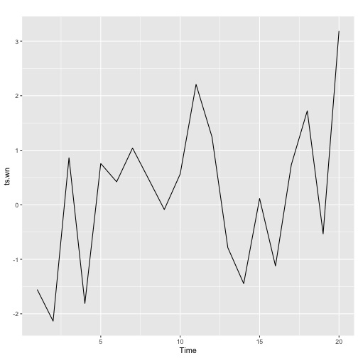<!-- -->
]

.pull-right[


```r
ggAcf(ts.wn)
```

<!-- -->

]

White noise implies stationarity.

---

# Recap: Stationarity

.pull-left[


```r
library(fpp2)
autoplot(uschange[,"Consumption"], main="Changes in US consumption and income")
```

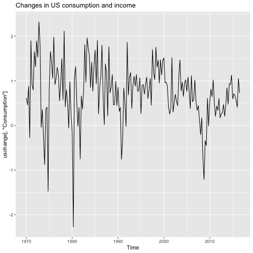<!-- -->
]

.pull-right[


```r
ggAcf(uschange[,"Consumption"])
```

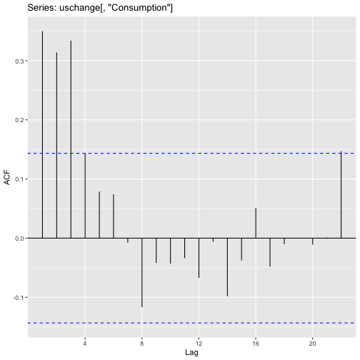<!-- -->

]

Stationarity does not imply white noise.
---
# Non-Stationary Time Series

**1. Deterministic trend**

$$Y_t  = f(t) + \epsilon_t$$


where $\epsilon_t \sim iid(0, \sigma^2)$, $t = 1, 2, ...T$

Mean of the process is time dependent, but the variance of the process is constant.

**2. Random walk** 

$$Y_t = Y_{t-1} + \epsilon_t$$

- Random walk has a stochastic trend.

- Model behind naive method.

**3. Random walk with drift**

$$Y_t = \alpha+  Y_{t-1} + \epsilon_t$$

- Random walk with drift has a stochastic trend and a deterministic trend.

- Model behind drift method.
---

# Random walk


$$
\begin{aligned}
  Y_t &= Y_{t-1} + \epsilon_t \\
     Y_1    &= Y_0 + \epsilon_1 \\
         Y_2 &=  Y_1 + \epsilon_1=Y_0 + \epsilon_1 + \epsilon_2\\
          Y_3 &=  Y_2 + \epsilon_3=Y_0 + \epsilon_1 + \epsilon_2 +\epsilon_3\\
          .   \\
          Y_t &=Y_{t-1} + \epsilon_t=Y_0 + \epsilon_1 + \epsilon_2 + \epsilon_3 +...+ \epsilon_t = Y_0 + \sum_{i=1}^{t} \epsilon_t
\end{aligned}
$$

Mean: $E(Y_t) = Y_0$.

Variance: $Var(Y_t)=t \sigma^2$.


---

## Random walk generation 

.pull-left[

```r
# method 1
set.seed(100)
n <- 100
error <- rnorm(n, sd=2)
# assume y0=0 (starting at 0)
rw.ts <- cumsum(error)
```


```r
autoplot(as.ts(rw.ts))
```

<!-- -->

]


.pull-right[

```r
# method 2
rw.ts <- rep(0, n)
for (i in seq.int(2, n)){
  rw.ts[i] <- rw.ts[i-1] + error[i]
}
rw.ts <- rw.ts 
```


```r
autoplot(as.ts(rw.ts))
```

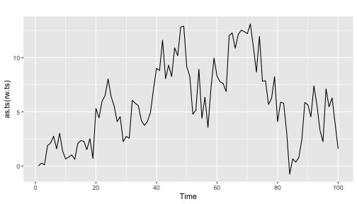<!-- -->
]

---

# Random walk with drift


$$
\begin{aligned}
  Y_t &= Y_{t-1} + \epsilon_t \\
     Y_1    &= \alpha+Y_0 + \epsilon_1 \\
         Y_2 &= \alpha+ Y_1 + \epsilon_1=2 \alpha+Y_0 + \epsilon_1 + \epsilon_2\\
          Y_3 &= \alpha+ Y_2 + \epsilon_3= 3 \alpha+ Y_0 + \epsilon_1 + \epsilon_2 +\epsilon_3\\
          .   \\
          Y_t &= \alpha+Y_{t-1} + \epsilon_t= t \alpha+ Y_0 + \epsilon_1 + \epsilon_2 + \epsilon_3 +...+ \epsilon_t = t \alpha + Y_0 + \sum_{i=1}^{t} \epsilon_t
\end{aligned}
$$

It has a *deterministic trend* $(Y_0 + t \alpha)$ and a *stochastic trend* $\sum_{i=1}^{t} \epsilon_t$.

Mean: $E(Y_t) = Y_0 + t\alpha$

Variance: $Var(Y_t) = t\sigma^2$.

There is a trend in both mean and variance. 


---

# Simulate a random walk with drift


```r
n <- 200
error <- rnorm(n, sd=2)
alpha <- 2
y1 <- rep(0, n)
for (i in seq.int(2, n)){
  y1[i] <- alpha + y1[i-1] + error[i]
}

autoplot(as.ts(y1))
```

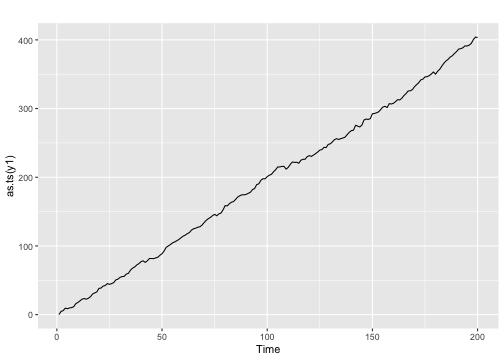<!-- -->

---
## Common trend removal (de-trending) procedures

1. Deterministic trend: Time-trend regression

      The trend can be removed by fitting a deterministic polynomial time trend. The residual series after removing the trend will give us the de-trended series.

1. Stochastic trend: Differencing
 
      The process is also known as a **Difference-stationary process**.

      
# Notation: I(d)

Integrated to order $d$: Series can be made stationary by differencing $d$ times.
 
 - Known as $I(d)$ process.
 

**Question: ** Show that random walk process is an $I(1)$ process.

The random walk process is called a unit root process.
(If one of the roots turns out to be one, then the process is called unit root process.)

---

# Variance stabilization

Eg:

- Square root: $W_t = \sqrt{Y_t}$

- Logarithm: $W_t = log({Y_t})$

     - This very useful.
     
     - Interpretable: Changes in a log value are **relative (percent) changes on the original sclae**.
     


---

### Monthly Airline Passenger Numbers 1949-1960

.pull-left[

**Without transformations**

<!-- -->

]

.pull-right[

**Square root transformation**

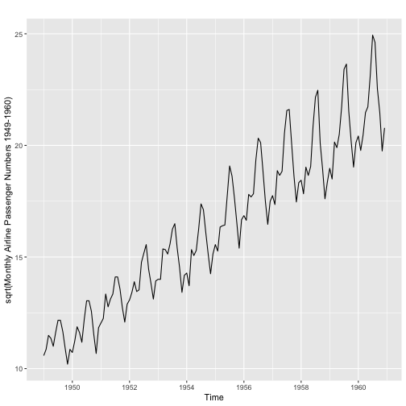<!-- -->
]
---


### Australian monthly electricity production: Jan 1956 – Aug 1995

.pull-left[

**Without transformations**

<!-- -->

]

.pull-right[

**Logarithm transformation**

<!-- -->
]

---

# Box-Cox transformation

$$
  w_t=\begin{cases}
    log(y_t), & \text{if $\lambda=0$} \newline
    (Y_t^\lambda - 1)/ \lambda, & \text{otherwise}.
  \end{cases}
$$


Different values of $\lambda$ gives you different transformations.

- $\lambda=1$: No **substantive** transformation

- $\lambda = \frac{1}{2}$: Square root plus linear transformation

- $\lambda=0$: Natural logarithm

- $\lambda = -1$: Inverse plus 1

Balance the seasonal fluctuations and random variation across the series.

---

# Box-Cox transformation: R codes

**BoxCox.lambda: Automatic selection of Box Cox transformation parameter**


```r
forecast::BoxCox.lambda(AirPassengers)
```

```
[1] -0.2947156
```

Some times this value is not sensible.

**BoxCox: Transformation of the input variable using a Box-Cox transformation**

```r
lambda <- forecast::BoxCox.lambda(AirPassengers)
w <- BoxCox(AirPassengers, lambda)
```

You can pass a user-defined value for `lambda`.

**InvBoxCox: Reverse transformation**

```r
InvBox(w)
```

---

## Box-Cox transformation on `AirPassengers`

.pull-left[

**Without transformations**

```r
autoplot(AirPassengers)+ylab("Monthly Airline Passenger Numbers 1949-1960")
```

<!-- -->

]

.pull-right[

**Box-Cox transformation**

```r
lambda <- forecast::BoxCox.lambda(AirPassengers)
*autoplot(BoxCox(AirPassengers, lambda))+
ylab("Monthly Airline Passenger Numbers 1949-1960")
```


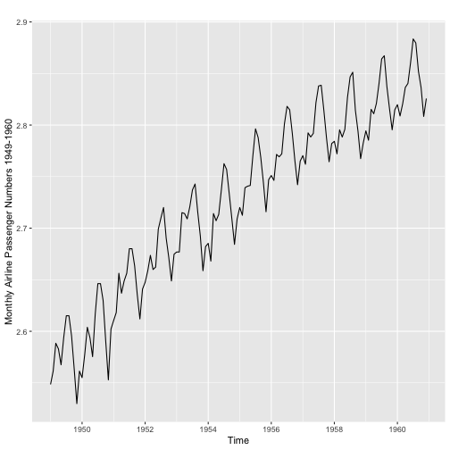<!-- -->
]

What differences do you notice in the scale?
---

## Note: Box-Cox Transformation

- If $\lambda = 0$? 

    - Behaves like log transformation. 
    
    - Force forecasts to be positive.
--

- If $\lambda =1$? No transformation is needed.
--

- If some $Y_t = 0$?, then must have $\lambda > 0$.
--
- If some $Y_t < 0$? Use power transformation or adjust the time series **by adding a constant to all values.**

--

- Choose a simple value of $\lambda$. It makes explanations easier.

--

- Transformation oftem makes little difference to forecasts but has large effects on PI.

---
# Application

`snaive` + applying BoxCox transformation

.pull-left[


```r
fit <- snaive(AirPassengers, lambda = 0)
autoplot(fit)
```

<!-- -->
]

.pull-right[

## Steps: 

✅ apply Box-Cox transformation.

✅ fit a model.

✅ reverse transformation.

]

<!-- R will do the Box-Cox transformation, Fit model, back transformation-->

---

## What differences do you notice?

.pull-left[

<!-- -->
]

.pull-right[

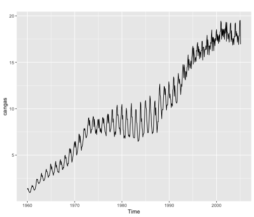<!-- -->


]

<!--Monotonically increasing variance vs Non-monotonically increasing variance. Any monotonic transformation wouldn't work here. When you apply boxcox transformation it will transform one part and do the opposite for the other part. There are different ways to handle this. What transformation would work for cangas data set. Video:sd1-4 (48) -->

---

## ARMA(p, q) model


$$Y_t=c+\phi_1Y_{t-1}+...+\phi_p Y_{t-p}+ \theta_1\epsilon_{t-1}+...+\theta_q\epsilon_{t-q}+\epsilon_t$$

- These are stationary models.

- They are only suitable for **stationary series**.

## ARIMA(p, d, q) model

Differencing --> ARMA

**Step 1: Differencing**

$$Y'_t = (1-B)^dY_t$$

**Step 2: ARMA**

$$Y'_t=c+\phi_1Y'_{t-1}+...+\phi_p Y'_{t-p}+ \theta_1\epsilon_{t-1}+...+\theta_q\epsilon_{t-q}+\epsilon_t$$

---

# Time series simulation

$$Y_t = 0.8Y_{t-1}+\epsilon_t$$


```r
set.seed(2020)
ts.sim <- arima.sim(list(order = c(1,0,0), ar = 0.8), n = 50)
ts.sim
```

```
Time Series:
Start = 1 
End = 50 
Frequency = 1 
 [1]  2.27965683  1.93415746  0.73482131 -0.15584512  0.97066897  3.21190889
 [7]  2.95764558  2.65674413  1.83979702  1.54785233  0.67798326  0.98957498
[13]  1.70016112  0.85506930  0.38305143 -0.41959484 -1.51575290 -0.95952760
[19] -1.13833338 -0.88848714 -0.05074559  0.44819716  0.16976781  0.73717377
[25] -0.08402103  0.40883341  0.44581996  0.47788225  0.19625900 -1.17126398
[31] -1.50393414 -0.62431338  1.40958653  1.37842627 -0.49557405  2.80517251
[37]  3.19937338  2.92814332  3.26543373  2.40682564  2.01842721  1.78300395
[43]  2.22224228  3.42379943  1.02211523  0.49934908 -0.50466071 -1.10772136
[49] -2.66427655 -2.85367641
```

> Use `?arima.sim` to view more examples.

---

# Automated ARIMA algorithm


```r
Arima(ts.sim, order=c(1, 0, 0), include.mean = FALSE)
```

```
Series: ts.sim 
ARIMA(1,0,0) with zero mean 

Coefficients:
         ar1
      0.8410
s.e.  0.0791

sigma^2 estimated as 0.98:  log likelihood=-70.55
AIC=145.1   AICc=145.36   BIC=148.93
```

<!--Not exactly equals to 0.8, due to an estimation error.-->
---


# Interpretation of R output: ARIMA model 

.content-box-yellow[Intercept form]

Using the backshift notation.

$$(1-\phi_1B-...-\phi_pB^p)Y'_t=c+(1+\theta_1B+...+\theta_qB^q)\epsilon_t$$

.content-box-yellow[Mean form]

$$(1-\phi_1B-...-\phi_pB^p)(Y'_t-\mu)=c+(1+\theta_1B+...+\theta_qB^q)\epsilon_t$$
Where,

 - $Y'_t=(1-B)^dY_t$
 
 - $\mu = E(Y'_t)$, when $d \neq 0$, otherwise $\mu = E(Y'_t)$.
 
 - $c = \mu(1-\phi_1 - ... - \phi_p)$
 
 R always return an estimate of $\mu$. 
 
 
 <!--How constant relate to the mean of the process. These forms are equivalent. When you can relate c to mu. ARMA models are fitted to the stationary data. Hence, we get mean of stationary data. Data can be stationary in two ways, on it's own or by taking the differencing. If differencing is applied, then you get mean of differenced series, otherwise you get mean of original series.-->


---

**1. Generate data from a model with a drift**

$$Y_t = 10+0.5Y_{t-1}+\epsilon_t$$

```r
set.seed(22)
y <- 10 + arima.sim(list(ar=.8),n=200)
```


**2. Fit an ARIMA model to generated data**


```r
Arima(as.ts(y),order=c(1,0,0))
```

```
Series: as.ts(y) 
ARIMA(1,0,0) with non-zero mean 

Coefficients:
         ar1    mean
      0.8345  9.2722
s.e.  0.0384  0.4131

sigma^2 estimated as 0.991:  log likelihood=-282.48
AIC=570.95   AICc=571.07   BIC=580.85
```

$E(Y_t)=\frac{\phi_0}{1-\phi_1}$

$\phi_0 = 8.8345 \times (1-0.0384) = 9.575901$


---


```r
ts.sim2 <- arima.sim(list(order = c(0,1,0)), n = 50)
```


```r
Arima(ts.sim2, order=c(0, 1, 0))
```

```
Series: ts.sim2 
ARIMA(0,1,0) 

sigma^2 estimated as 1.044:  log likelihood=-72.02
AIC=146.04   AICc=146.12   BIC=147.95
```

---

# `Arima` in R

1. When $d=0$, provides estimate of $\mu = E(Y_t)$.

2. Default setting is `include.mean=TRUE`. Setting `includemean=FALSE` will force $c=\mu=0$.

3. When $d > 0$ sets $c=\mu=0$.

4. When $d=1$ setting `include.drift=TRUE`, estimates $\mu\neq0$ as `drift`.

5. When $d>1$ no constant is allowed.

---
class: duke-orange, center, middle

# Identifying suitable ARIMA models

---

# Modelling steps

1. Plot the data.

--
2. If necessary, transform the data (using a Box-Cox transformation) to stabilise the variance.
--

3. If the data are non-stationary, take first differences of the data until the data are stationary.
--

4. Examine the ACF/PACF to identify a suitable model.
--

5. Try your chosen model(s), and use the AICc to search for a better model.
--

6. Check the residuals from your chosen model by plotting the ACF of the residuals, and doing a portmanteau test of the residuals. If they do not look like white noise, try a modified model.

--
7. Once the residuals look like white noise, calculate forecasts.

Source: Forecasting: Principles and Practice, Rob J Hyndman and George Athanasopoulos

---
# Step 0: Split time series into training and test sets


```r
training.ap <- window(AirPassengers, end=c(1957, 12))
training.ap
```

```
     Jan Feb Mar Apr May Jun Jul Aug Sep Oct Nov Dec
1949 112 118 132 129 121 135 148 148 136 119 104 118
1950 115 126 141 135 125 149 170 170 158 133 114 140
1951 145 150 178 163 172 178 199 199 184 162 146 166
1952 171 180 193 181 183 218 230 242 209 191 172 194
1953 196 196 236 235 229 243 264 272 237 211 180 201
1954 204 188 235 227 234 264 302 293 259 229 203 229
1955 242 233 267 269 270 315 364 347 312 274 237 278
1956 284 277 317 313 318 374 413 405 355 306 271 306
1957 315 301 356 348 355 422 465 467 404 347 305 336
```

```r
test.ap <- window(AirPassengers, start=c(1958, 1))
test.ap
```

```
     Jan Feb Mar Apr May Jun Jul Aug Sep Oct Nov Dec
1958 340 318 362 348 363 435 491 505 404 359 310 337
1959 360 342 406 396 420 472 548 559 463 407 362 405
1960 417 391 419 461 472 535 622 606 508 461 390 432
```

---


```r
autoplot(AirPassengers) + 
  geom_vline(xintercept = 1958, colour="forestgreen")
```

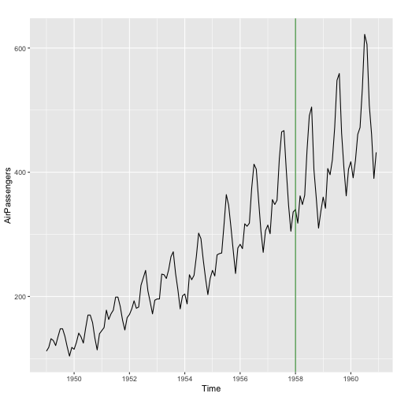<!-- -->

---

# Step 1: Plot data

1. Detect unusual observations in the data

1. Detect non-stationarity by visual inspections of plots

Stationary series:

- has a constant mean value and fluctuates around the mean.

- constant variance.

- no pattern predictable in the long-term.

---

# Step 1: Plot data (cont.)

.pull-left[

```r
autoplot(training.ap)
```

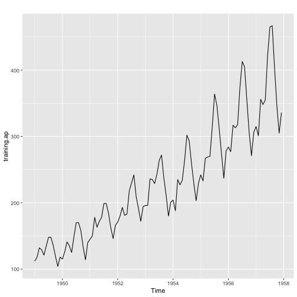<!-- -->
]

.pull-right[

1. Transformations help to stabilize the variance.

1. Differencing helps to stabilize the mean.


.content-box-yellow[

1. Need transformations?

2. Need differencing?

]

]

---

# Step 2: Apply transformations


```r
log.airpassenger <- log(training.ap)
#log.airpassenger <- BoxCox(training.ap, lambda = 0)
autoplot(log.airpassenger)
```

<!-- -->

---

## Step 3: Take difference series

### Identifying non-stationarity by looking at plots

- Time series plot

- The ACF of stationary data drops to zero relatively quickly.

- The ACF of non-stationary data decreases slowly.

- For non-stationary data, the value of $r_t$ is often large and positive.

--
### Recap: Non-seasonal differencing and seasonal differencing

** Non seasonal first-order differencing:** $Y'_t=Y_t - Y_{t-1}$

<!--Miss one observation-->

**Non seasonal second-order differencing:** $Y''_t=Y'_t - Y'_{t-1}$

<!--Miss two observations-->

**Seasonal differencing:** $Y_t - Y_{t-m}$

<!--To get rid from prominent seasonal components. -->

- For monthly, $m=12$, for quarterly, $m=4$.

<!--We will loosefirst 12 observations-->


- Seasonally differenced series will have $T-m$ observations.
<!--Usually we do not consider differencing more than twice. -->

> There are times differencing once is not enough. However, in practice,it is almost never necessary to go beyound second-order differencing.

<!--Even the second-order differencing is very rare.-->

---
# Step 3: Take difference series (cont.)

🙋

.content-box-yellow[Seasonal differencing or Non-seasonal differencing?]

<!--Take seasonal differencing first. Seasonal differencing might be enough, you do not need to do further differencing. First order seasonal differencing never removes the seasonal effect.-->

🙋

.content-box-yellow[Interpretation of differencing?]

<!--It is important that if the differencing is used, the differences are interpretable. -->

<!--First differences are the change between one observation and the next. Changes of index. Second order differencing is changes of changes.-->

<!--Seasonal differences are the change between one year to the next.-->

<!--But taking lag 3 differences for yearly data, for example, results in a model which cannot be sensible interpreted.-->

<!--It is important that the differencing are interpretable.-->
---

# Step 3: Take difference series (cont.)

.pull-left[


```r
autoplot(log.airpassenger)
```

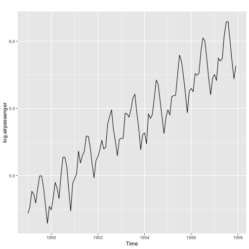<!-- -->

]

.pull-right[

```r
ggAcf(log.airpassenger)
```

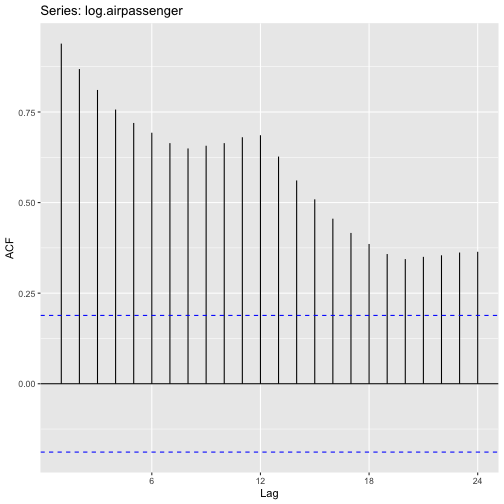<!-- -->

]

---
# Step 3: Take difference series (cont.)

## Operations of differencing

.pull-left[


```r
autoplot(log.airpassenger)
```

<!-- -->

]

.pull-right[

```r
library(magrittr) # to load %>%
#autoplot(diff(log.airpassenger,lag=12))
log.airpassenger %>% diff(lag=12)  %>% autoplot()
```

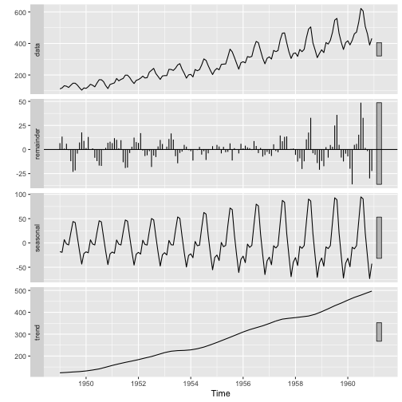<!-- -->

Does this look stationary?
]

<!--Strongseasonal component is now vanished. Does this look stationary? -->

---
# Step 3: Take difference series (cont.)

.pull-left[

```r
library(magrittr) # to load %>%
#autoplot(diff(log.airpassenger,lag=12))
log.airpassenger %>% diff(lag=12)  %>% autoplot()
```

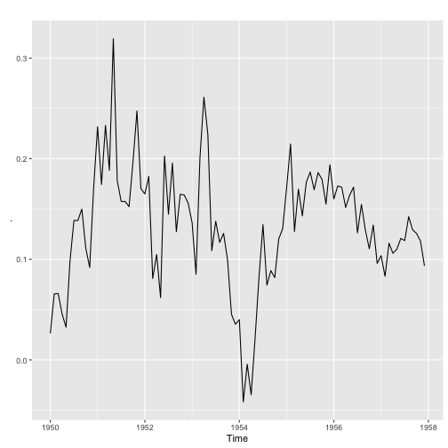<!-- -->

]


.pull-right[

```r
log.airpassenger %>% 
  diff(lag=12) %>% 
  ggAcf()
```

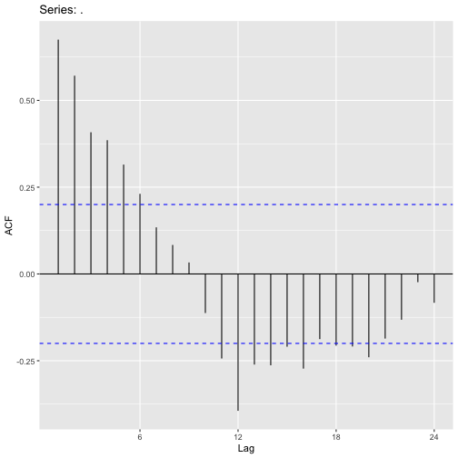<!-- -->

]

---

# Step 3: Take difference series (cont.)

.pull-left[

```r
library(magrittr) # to load %>%
#autoplot(diff(log.airpassenger,lag=12))
log.airpassenger %>% 
  diff(lag=12) %>% 
  diff(lag=1)  %>% 
  autoplot()
```

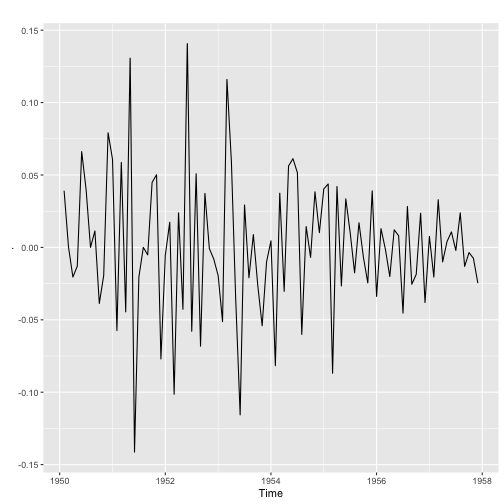<!-- -->

<!--Code for second-order differencing: 
log.airpassenger %>% 
  diff(lag=12) %>% 
  diff(lag=1)  %>% 
  diff(lag=1) %>%
  autoplot() -->

]


.pull-right[

```r
log.airpassenger %>% 
  diff(lag=12) %>% 
  diff(lag=1)  %>% 
  ggAcf()
```

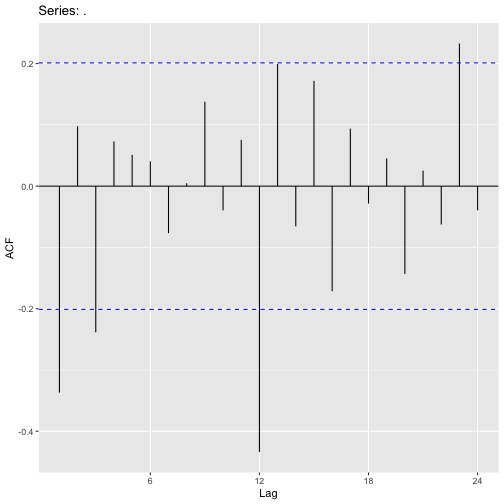<!-- -->

]
---

# Testing for nonstationarity for the presence of unit roots


- Dickey and Fuller (DF) test

- Augmented DF test

- Phillips and Perron (PP) nonparametric test

-  Kwiatkowski-Phillips-Schmidt-Shin (KPSS) test

---

# KPSS test

**H0:** Series is level or trend stationary.

**H1:** Series is not stationary.


```r
library(urca)
diff.sdiff.log.passenger <- log.airpassenger %>% 
  diff(lag=12) %>% 
  diff(lag=1)

diff.sdiff.log.passenger %>%
  ur.kpss() %>%
  summary()
```

```

####################### 
# KPSS Unit Root Test # 
####################### 

Test is of type: mu with 3 lags. 

Value of test-statistic is: 0.0942 

Critical value for a significance level of: 
                10pct  5pct 2.5pct  1pct
critical values 0.347 0.463  0.574 0.739
```

---

# KPSS test 


```r
ur.kpss(log.airpassenger) %>% summary()
```

```

####################### 
# KPSS Unit Root Test # 
####################### 

Test is of type: mu with 4 lags. 

Value of test-statistic is: 2.113 

Critical value for a significance level of: 
                10pct  5pct 2.5pct  1pct
critical values 0.347 0.463  0.574 0.739
```


```r
sdiff.log.airpassenger <- training.ap %>% log() %>% diff(lag=12)
ur.kpss(sdiff.log.airpassenger) %>% summary()
```

```

####################### 
# KPSS Unit Root Test # 
####################### 

Test is of type: mu with 3 lags. 

Value of test-statistic is: 0.1264 

Critical value for a significance level of: 
                10pct  5pct 2.5pct  1pct
critical values 0.347 0.463  0.574 0.739
```

<!--This gives an idea about only non-seasonal differencing-->

---

# How many differences you need to take?

Non-seasonal: Automatically selecting differences.

<!--With this command you do not need to run KPSS test. It will automatically run the test inside and returns you how many times you need to do differencing.-->


```r
ndiffs(log.airpassenger)
```

```
[1] 1
```


```r
ndiffs(sdiff.log.airpassenger)
```

```
[1] 0
```


```r
ndiffs(diff.sdiff.log.passenger)
```

```
[1] 0
```
---
# How many differences you need to take? (cont.)

Seaonal - Automatically selecting differences.

.pull-left[
STL decomposition: $Y_t = T_t + S_t + R_t$

Strength of seasonality: 

$$F_s = max \left(0, 1-\frac{Var(R_t)}{Var(S_t + R_t)}\right)$$


```r
nsdiffs(log.airpassenger)
```

```
[1] 1
```


```r
log.airpassenger %>% diff(lag=1) %>% nsdiffs()
```

```
[1] 1
```


```r
nsdiffs(sdiff.log.airpassenger)
```

```
[1] 0
```
]

.pull-right[

```r
training.ap %>% stl(s.window = 12) %>% autoplot()
```

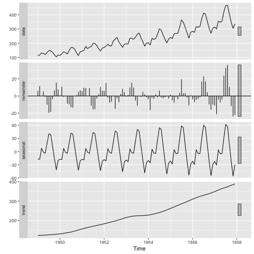<!-- -->

]
<!--This is for number of seasonal differencing needed.-->

---
# Step 4: Examine the ACF/PACF to identify a suitable model


```r
ggtsdisplay(diff.sdiff.log.passenger)
```

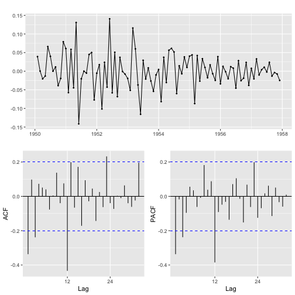<!-- -->

---
background-image: url('sar.PNG')
background-position: center
background-size: contain
---
## AR(p)

- ACF dies out in an exponential or damped
sine-wave manner.

- there is a signicant spike at lag $p$ in PACF, but
none beyond $p$.

## MA(q)

- ACF has all zero spikes beyond the $q^{th}$ spike.

- PACF dies out in an exponential or damped
sine-wave manner.

## Seasonal components

- The seasonal part of an AR or MA model will be seen
in the seasonal lags of the PACF and ACF.

.pull-left[
**ARIMA(0,0,0)(0,0,1)12 will show**
 
  - a spike at lag 12 in the ACF but no other significant spikes.

  - The PACF will show exponential decay in the seasonal lags  12, 24, 36, . . . .
]

.pull-right[
**ARIMA(0,0,0)(1,0,0)12 will show**

  - exponential decay in the seasonal lags of the ACF.
    
  - a single significant spike at lag 12 in the PACF.
]
---
background-image: url(Akaike.jpg)
background-size: 100px
background-position: 98% 6%

# Information criteria


- Akaike's Information Criterion (AIC)

$$AIC = -2log(L)+2(p+q+k+1)$$
where $L$ is the likelihood of the data, $k=1$ if $c\neq 0$ and $k=0$ if $c=0$.

- Corrected AIC

$$AICc=AIC + \frac{2(p+q+k+1)(p+q+k+2)}{T-p-q-k-2}$$
-Bayesian Information Criterion

$$BIC=AIC+[log(T)-2](p+q+k-1)$$

 - Good models are obtained by minimizing either the $AIC, AICc$ or $BIC$. 
 
 - Our preference is to use the $AICc$.
 
 - AICc comparisons must have the same orders of differencing.


---

## Step 4: Examine the ACF/PACF to identify a suitable model (cont.)


```r
ggtsdisplay(diff.sdiff.log.passenger)
```

<!-- -->

---

## Step 4: Examine the ACF/PACF to identify a suitable model (cont.)

- $d=1$ and $D=1$ (from step 3)

- Significant spike at lag 1 in ACF suggests
non-seasonal MA(1) component.

- Significant spike at lag 12 in ACF suggests seasonal
MA(1) component.

- Initial candidate model: $ARIMA(0,1,1)(0,1,1)_{12}$.

- By analogous logic applied to the PACF, we could also have started with $ARIMA(1,1,0)(1,1,0)_{12}$.

- Let's try both
<!--Since the second is not significant, I did not consider 3. I started with the simplest.-->

---

**Initial model:**

$ARIMA(0,1,1)(0,1,1)_{12}$

$ARIMA(1,1,0)(1,1,0)_{12}$

**Try some variations of the initial model:**

$ARIMA(0,1,1)(1,1,1)_{12}$

$ARIMA(1,1,1)(1,1,0)_{12}$

$ARIMA(1,1,1)(1,1,1)_{12}$


Both the ACF and PACF show significant spikes at lag 3, and almost significant spikes at lag 3, indicating that some additional non-seasonal terms need to be included in the model.

$ARIMA(3,1,1)(1,1,1)_{12}$

$ARIMA(1,1,3)(1,1,1)_{12}$

$ARIMA(3,1,3)(1,1,1)_{12}$
---
.pull-left[

```r
fit1 <- Arima(training.ap, 
              order=c(0,1,1),
seasonal=c(0,1,1), lambda = 0)
fit1
```

```
Series: training.ap 
ARIMA(0,1,1)(0,1,1)[12] 
Box Cox transformation: lambda= 0 

Coefficients:
          ma1     sma1
      -0.3864  -0.5885
s.e.   0.1097   0.0927

sigma^2 estimated as 0.001416:  log likelihood=175.3
AIC=-344.59   AICc=-344.33   BIC=-336.93
```
]

---


```r
fit2 <- Arima(training.ap, 
              order=c(1,1,0),
seasonal=c(1,1,0), lambda = 0)
fit2
```

```
Series: training.ap 
ARIMA(1,1,0)(1,1,0)[12] 
Box Cox transformation: lambda= 0 

Coefficients:
          ar1     sar1
      -0.3635  -0.4548
s.e.   0.0957   0.0889

sigma^2 estimated as 0.001578:  log likelihood=171.29
AIC=-336.59   AICc=-336.32   BIC=-328.92
```

---

```r
fit3 <- Arima(training.ap, 
              order=c(0,1,1),
seasonal=c(1,1,1), lambda = 0)
fit3
```

```
Series: training.ap 
ARIMA(0,1,1)(1,1,1)[12] 
Box Cox transformation: lambda= 0 

Coefficients:
          ma1     sar1     sma1
      -0.3941  -0.0714  -0.5347
s.e.   0.1108   0.1798   0.1672

sigma^2 estimated as 0.00143:  log likelihood=175.37
AIC=-342.75   AICc=-342.3   BIC=-332.53
```
---


```r
fit4 <- Arima(training.ap, 
              order=c(1,1,1),
seasonal=c(1,1,0), lambda = 0)
fit4
```

```
Series: training.ap 
ARIMA(1,1,1)(1,1,0)[12] 
Box Cox transformation: lambda= 0 

Coefficients:
         ar1      ma1     sar1
      0.1015  -0.5221  -0.4600
s.e.  0.2423   0.2113   0.0887

sigma^2 estimated as 0.001561:  log likelihood=172.26
AIC=-336.52   AICc=-336.08   BIC=-326.31
```
---


```r
fit5 <- Arima(training.ap, 
              order=c(1,1,1),
seasonal=c(1,1,1), lambda = 0)
fit5
```

```
Series: training.ap 
ARIMA(1,1,1)(1,1,1)[12] 
Box Cox transformation: lambda= 0 

Coefficients:
         ar1      ma1     sar1     sma1
      0.2565  -0.6243  -0.0599  -0.5574
s.e.  0.2759   0.2289   0.1765   0.1670

sigma^2 estimated as 0.00143:  log likelihood=175.71
AIC=-341.42   AICc=-340.74   BIC=-328.65
```
---


```r
fit6 <- Arima(training.ap, 
              order=c(3,1,1),
seasonal=c(1,1,1), lambda = 0)
fit6
```

```
Series: training.ap 
ARIMA(3,1,1)(1,1,1)[12] 
Box Cox transformation: lambda= 0 

Coefficients:
         ar1     ar2      ar3      ma1     sar1     sma1
      0.1451  0.0681  -0.1705  -0.5133  -0.0165  -0.5928
s.e.  0.3473  0.1598   0.1139   0.3440   0.1822   0.1703

sigma^2 estimated as 0.001418:  log likelihood=177.09
AIC=-340.17   AICc=-338.89   BIC=-322.3
```

---


```r
fit7 <- Arima(training.ap, 
              order=c(1,1,3),
seasonal=c(1,1,1), lambda = 0)
fit7
```

```
Series: training.ap 
ARIMA(1,1,3)(1,1,1)[12] 
Box Cox transformation: lambda= 0 

Coefficients:
         ar1      ma1     ma2      ma3     sar1    sma1
      0.0567  -0.4268  0.0831  -0.2275  -0.0094  -0.617
s.e.  0.3512   0.3362  0.1663   0.1182   0.1775   0.166

sigma^2 estimated as 0.001402:  log likelihood=177.35
AIC=-340.71   AICc=-339.42   BIC=-322.83
```

---

```r
fit8 <- Arima(training.ap, 
              order=c(3,1,3),
seasonal=c(1,1,1), lambda = 0)
fit8
```

```
Series: training.ap 
ARIMA(3,1,3)(1,1,1)[12] 
Box Cox transformation: lambda= 0 

Coefficients:
          ar1     ar2     ar3     ma1      ma2      ma3    sar1     sma1
      -0.8843  0.6075  0.5633  0.4941  -0.9725  -0.5215  0.0243  -0.5959
s.e.   0.5123  0.2072  0.3099  0.6076   0.0814   0.5842  0.2091   0.1773

sigma^2 estimated as 0.001368:  log likelihood=177.88
AIC=-337.77   AICc=-335.65   BIC=-314.78
```

---
**Initial model: AICc**

$ARIMA(0,1,1)(0,1,1)_{12}$: -344.33 (the smallest AICc)

$ARIMA(1,1,0)(1,1,0)_{12}$: -336.32

**Try some variations of the initial model:**

$ARIMA(0,1,1)(1,1,1)_{12}$: -342.3 (second smallest AICc)

$ARIMA(1,1,1)(1,1,0)_{12}$: -336.08

$ARIMA(1,1,1)(1,1,1)_{12}$: -340.74

$ARIMA(3,1,1)(1,1,1)_{12}$: -338.89 

$ARIMA(1,1,3)(1,1,1)_{12}$: -339.42 

$ARIMA(3,1,3)(1,1,1)_{12}$: -335.65

---

# Step 6: Residual diagnostics

## Fitted values: 

$\hat{Y}_{t|t-1}$: Forecast of $Y_t$ based on observations $Y_1,...Y_t$.


## Residuals

$$e_t=Y_t - \hat{Y}_{t|t-1}$$

### Assumptions of residuals

- $\{e_t\}$ uncorrelated. If they aren't, then information left in residuals that should be used in computing forecasts.

<!--If you see autocorrelations, then you should go back and adjust residuals. In theoretically, If there is information leftover and we can do something better. But it is not the case you will also be able to do with. If can't you can't. Then stop. If you check you know you have done the best as you can.-->

- $\{e_t\}$ have mean zero. If they don't, then forecasts are biased.

<!--If you see autocorrelations, then you should go back and adjust residuals. We want our residuals to be unbiased. If the mean is not zero. Go and adjust the model. Add an intercept. Whatever you want to do.-->

### Useful properties (for prediction intervals)

- $\{e_t\}$ have constant variance.

- $\{e_t\}$ are normally distributed.

<!--If the following assumptions are wrong that doesn't mean your forecasts are incorrect. -->


---
# Step 6: Residual diagnostics (cont.)

H0: Data are not serially correlated.

H1: Data are serially correlated.


```r
checkresiduals(fit1)
```

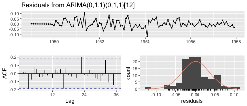<!-- -->

```

	Ljung-Box test

data:  Residuals from ARIMA(0,1,1)(0,1,1)[12]
Q* = 14.495, df = 20, p-value = 0.8045

Model df: 2.   Total lags used: 22
```

---
# Step 6: Residual diagnostics (cont.)


```r
fit1 %>% residuals() %>% ggtsdisplay()
```

<!-- -->
---
# Step 6: Residual diagnostics (cont.)


```r
checkresiduals(fit3)
```

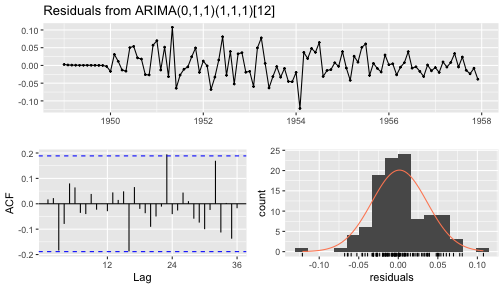<!-- -->

```

	Ljung-Box test

data:  Residuals from ARIMA(0,1,1)(1,1,1)[12]
Q* = 13.971, df = 19, p-value = 0.7854

Model df: 3.   Total lags used: 22
```

---
# Step 6: Residual diagnostics (cont.)


```r
fit3 %>% residuals() %>% ggtsdisplay()
```

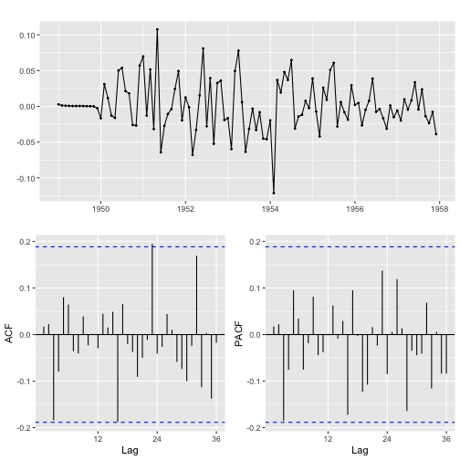<!-- -->
---

# Step 7: Calculate forecasts

.pull-left[
$ARIMA(0,1,1)(0,1,1)_{12}$


```r
fit1 %>% forecast(h=36) %>% 
  autoplot()
```

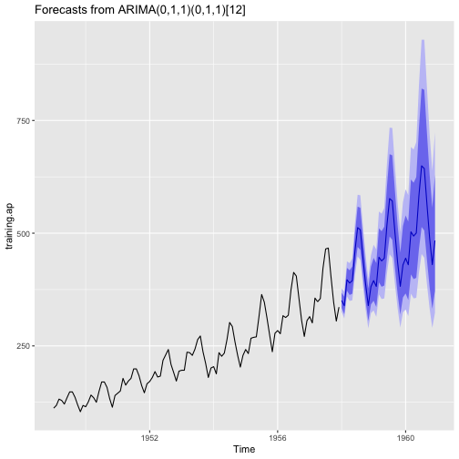<!-- -->
]

.pull-right[
$ARIMA(0,1,1)(1,1,1)_{12}$


```r
fit3 %>% forecast(h=36) %>% 
  autoplot()
```

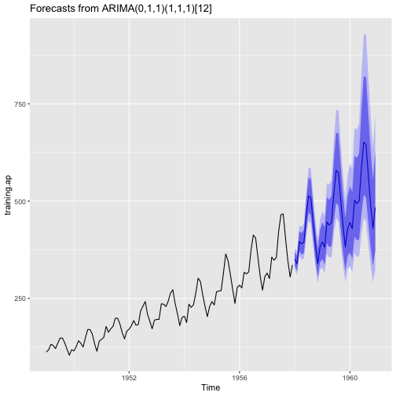<!-- -->

]
---


$ARIMA(0,1,1)(0,1,1)_{12}$


```r
fit1.forecast <- fit1 %>% forecast(h=36) 
fit1.forecast$mean
```

```
          Jan      Feb      Mar      Apr      May      Jun      Jul      Aug
1958 350.6592 339.1766 396.7654 389.3934 394.7295 460.6986 512.2818 507.5185
1959 394.8025 381.8745 446.7129 438.4129 444.4207 518.6945 576.7713 571.4083
1960 444.5029 429.9474 502.9482 493.6032 500.3674 583.9912 649.3792 643.3411
          Sep      Oct      Nov      Dec
1958 445.0042 386.2473 339.3564 381.5803
1959 501.0243 434.8708 382.0769 429.6162
1960 564.0966 489.6152 430.1753 483.6992
```


$ARIMA(0,1,1)(1,1,1)_{12}$


```r
fit3.forecast <- fit3 %>% forecast(h=36) 
fit3.forecast$mean
```

```
          Jan      Feb      Mar      Apr      May      Jun      Jul      Aug
1958 351.0115 339.0589 396.3161 389.4484 395.0305 461.6590 513.6099 507.9900
1959 395.2760 381.5215 446.3245 438.4261 444.8906 520.5608 578.7432 573.0358
1960 444.7886 429.3347 502.2289 493.3544 500.6143 585.7116 651.2077 644.7354
          Sep      Oct      Nov      Dec
1958 445.3297 386.3269 339.4872 381.8812
1959 501.8766 435.0725 382.3290 429.4328
1960 564.7108 489.5677 430.2174 483.2724
```


---

# Step 8: Evaluate forecast accuracy

## How well our model is doing for out-of-sample?


<!--So far we have talked about fitted values and residuals.-->

<!--Train data and Test data. We want to know if forecasts doing well for out-of-sample.-->

Forecast error = True value - Observed value

$$e_{T+h}=Y_{T+h}-\hat{Y}_{T+h|T}$$

Where,

$Y_{T+h}$: $(T+h)^{th}$ observation, $h=1,..., H$

$\hat{Y}_{T+h|T}$: Forecast based on data uo to time $T$.

- **True** forecast error as the test data is not used in computing $\hat{Y}_{T+h|T}$.

- Unlike, residuals, forecast errors on the test set involve multi-step forecasts.

- Use forecast error measures to evaluate the models.

<!--Since, true forecast error, no hat involved.-->


---

# Step 7: Evaluate forecast accuracy


$ARIMA(0,1,1)(0,1,1)_{12}$


```r
fit1.forecast <- fit1 %>% 
  forecast(h=36) 
```


```r
accuracy(fit1.forecast$mean, test.ap)
```

```
                ME   RMSE      MAE       MPE     MAPE       ACF1 Theil's U
Test set -33.71566 36.559 33.71566 -8.112567 8.112567 0.08524612 0.7974916
```


$ARIMA(0,1,1)(1,1,1)_{12}$


```r
fit3.forecast <- fit3 %>% 
  forecast(h=36) 
```


```r
accuracy(fit3.forecast$mean, test.ap)
```

```
                ME     RMSE      MAE       MPE     MAPE       ACF1 Theil's U
Test set -34.12174 36.87661 34.12174 -8.190874 8.190874 0.06782645 0.8019226
```


$ARIMA(0,1,1)(0,1,1)_{12}$ MAE, MAPE is smaller than $ARIMA(0,1,1)(1,1,1)_{12}$. Hence, we select $ARIMA(0,1,1)(0,1,1)_{12}$ to forecast future values.

---
class: duke-orange, center, middle

# Automated ARIMA algorithm: `auto.arima`

---

# Modelling steps: `auto.arima` 

1. Plot the data.

1. If necessary, transform the data (using a Box-Cox transformation) to stabilise the variance.

1. ~~If the data are non-stationary, take first differences of the data until the data are stationary.~~

1. ~~Examine the ACF/PACF to identify a suitable model.~~

1. ~~Try your chosen model(s), and use the AICc to search for a better model.~~

1. Check the residuals from your chosen model by plotting the ACF of the residuals, and doing a portmanteau test of the residuals. If they do not look like white noise, try a modified model.

1. Once the residuals look like white noise, calculate forecasts.

---

#  Modelling steps: `auto.arima`

1. Plot the data.

1. If necessary, transform the data (using a Box-Cox transformation) to stabilise the variance.

1. **Use `auto.arima` to select a model.**

1. Check the residuals from your chosen model by plotting the ACF of the residuals, and doing a portmanteau test of the residuals. If they do not look like white noise, try a modified model.

1. Once the residuals look like white noise, calculate forecasts.
--
# Introduction: `auto.arima`

- Hyndman and Khandakar ([JSS, 2008](/slides/v27iO3.pdf)) algorithm.

- Select no differences **d** and **D** via KPSS test and strength of seasonality measurement.

- Select **p, q** by minimising AICc.

- Use stepwise search to traverse model space.

---

**What is happening under the hood of `auto.arima`?**
--

**Step 1:** Select the number of differences d and D via unit root tests and strength of seasonality measure.
--

**Step 2:** Try four possible models to start with:

i) $ARIMA(2, d, 2)$ if $m = 1$ and $ARIMA(2, d, 2)(1, D, 1)_m$ if $m > 1$.

ii) $ARIMA(0, d, 0)$ if $m = 1$ and $ARIMA(0, d, 0)(0, D, 0)_m$ if $m > 1$.

iii) $ARIMA(1, d, 0)$ if $m = 1$ and $ARIMA(1, d, 0)(1, D, 0)_m$ if $m > 1$.

iv) $ARIMA(0, d, 1)$ if $m = 1$ and $ARIMA(0, d, 1)(0, D, 1)_m$ if $m > 1$.
--

**Step 3:** Select the model with the smallest AICc from step 2. This becomes the current model.
--

**Step 4:** Consider up to 13 variations on the current model:

i) Vary one of $p, q, P$ and $Q$ from the current model by $\pm 1$.

ii) $p, q$ both vary from the current model by $\pm 1$.

iii) $P, Q$ both vary from the current model by $\pm 1$.

iv) Include or exclude the constant term from the current model. Repeat step 4 until no lower AICc can be found. 


---

# `auto.arima` with AirPassenger 


```r
fit.auto.arima <- auto.arima(training.ap, lambda = 0)
fit.auto.arima
```

```
Series: training.ap 
ARIMA(2,0,0)(0,1,1)[12] with drift 
Box Cox transformation: lambda= 0 

Coefficients:
         ar1     ar2     sma1   drift
      0.5514  0.2033  -0.6177  0.0110
s.e.  0.1000  0.1018   0.0951  0.0006

sigma^2 estimated as 0.001315:  log likelihood=181.16
AIC=-352.32   AICc=-351.65   BIC=-339.5
```

Your turn:

 > Check the residuals from your chosen model by plotting the ACF of the residuals, and doing a portmanteau test of the residuals. If they do not look like white noise, try a modified model.
 
 > Calculate forecasts.

---

# Check the residuals


```r
fit.auto.arima %>% checkresiduals()
```

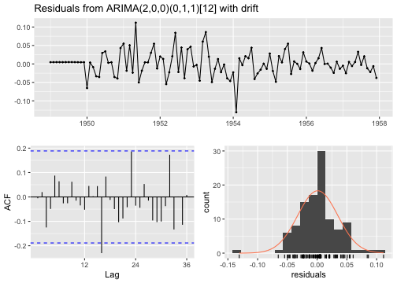<!-- -->

```

	Ljung-Box test

data:  Residuals from ARIMA(2,0,0)(0,1,1)[12] with drift
Q* = 15.971, df = 18, p-value = 0.5946

Model df: 4.   Total lags used: 22
```

---


```r
fit.auto.arima %>% residuals() %>% ggtsdisplay()
```

<!-- -->
---

### Change the number of lags and perform `Box.test` (optional)

Note that in `fit.auto.arima %>% checkresiduals()` performed the test for 22 lags.


```r
# lag=2m where m is the period of seasonality
# https://robjhyndman.com/hyndsight/ljung-box-test/
fit.auto.arima.resid <- fit.auto.arima %>% residuals()
Box.test(fit.auto.arima.resid, lag = 24, type = "Ljung-Box")
```

```

	Box-Ljung test

data:  fit.auto.arima.resid
X-squared = 20.988, df = 24, p-value = 0.6395
```

```r
Box.test(fit.auto.arima.resid, lag = 24, type = "Box-Pierce")
```

```

	Box-Pierce test

data:  fit.auto.arima.resid
X-squared = 17.549, df = 24, p-value = 0.8243
```
---

# Forecasting


```r
fit.auto.arima %>% forecast(h=36) %>% autoplot()
```

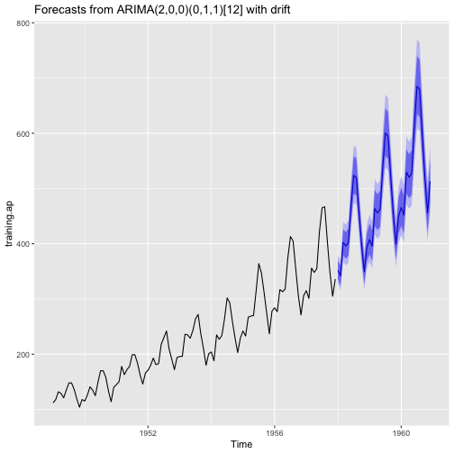<!-- -->

---

## Structure of the forecasting output


```r
forecast.auto.arima <- fit.auto.arima %>% forecast(h=36) 
str(forecast.auto.arima)
```

```
List of 10
 $ method   : chr "ARIMA(2,0,0)(0,1,1)[12] with drift"
 $ model    :List of 20
  ..$ coef     : Named num [1:4] 0.551 0.203 -0.618 0.011
  .. ..- attr(*, "names")= chr [1:4] "ar1" "ar2" "sma1" "drift"
  ..$ sigma2   : num 0.00131
  ..$ var.coef : num [1:4, 1:4] 1.00e-02 -7.00e-03 -7.29e-04 -1.50e-06 -7.00e-03 ...
  .. ..- attr(*, "dimnames")=List of 2
  .. .. ..$ : chr [1:4] "ar1" "ar2" "sma1" "drift"
  .. .. ..$ : chr [1:4] "ar1" "ar2" "sma1" "drift"
  ..$ mask     : logi [1:4] TRUE TRUE TRUE TRUE
  ..$ loglik   : num 181
  ..$ aic      : num -352
  ..$ arma     : int [1:7] 2 0 0 1 12 0 1
  ..$ residuals: Time-Series [1:108] from 1949 to 1958: 0.00471 0.00475 0.00485 0.00482 0.00474 ...
  ..$ call     : language auto.arima(y = training.ap, lambda = 0, x = list(x = c(4.71849887129509,  4.77068462446567, 4.88280192258637, 4.8| __truncated__ ...
  ..$ series   : chr "training.ap"
  ..$ code     : int 0
  ..$ n.cond   : int 0
  ..$ nobs     : int 96
  ..$ model    :List of 10
  .. ..$ phi  : num [1:2] 0.551 0.203
  .. ..$ theta: num [1:12] 0 0 0 0 0 0 0 0 0 0 ...
  .. ..$ Delta: num [1:12] 0 0 0 0 0 0 0 0 0 0 ...
  .. ..$ Z    : num [1:25] 1 0 0 0 0 0 0 0 0 0 ...
  .. ..$ a    : num [1:25] -0.03835 0.0002 0.01554 -0.00337 0.00351 ...
  .. ..$ P    : num [1:25, 1:25] 0.00 -5.93e-17 3.86e-18 -1.20e-17 1.04e-17 ...
  .. ..$ T    : num [1:25, 1:25] 0.551 0.203 0 0 0 ...
  .. ..$ V    : num [1:25, 1:25] 1 0 0 0 0 0 0 0 0 0 ...
  .. ..$ h    : num 0
  .. ..$ Pn   : num [1:25, 1:25] 1.00 -4.87e-05 -2.36e-05 -2.91e-06 -3.61e-06 ...
  ..$ xreg     : int [1:108, 1] 1 2 3 4 5 6 7 8 9 10 ...
  .. ..- attr(*, "dimnames")=List of 2
  .. .. ..$ : NULL
  .. .. ..$ : chr "drift"
  ..$ bic      : num -339
  ..$ aicc     : num -352
  ..$ x        : Time-Series [1:108] from 1949 to 1958: 112 118 132 129 121 135 148 148 136 119 ...
  ..$ lambda   : num 0
  .. ..- attr(*, "biasadj")= logi FALSE
  ..$ fitted   : Time-Series [1:108] from 1949 to 1958: 111 117 131 128 120 ...
  ..- attr(*, "class")= chr [1:3] "forecast_ARIMA" "ARIMA" "Arima"
 $ level    : num [1:2] 80 95
 $ mean     : Time-Series [1:36] from 1958 to 1961: 352 342 402 396 402 ...
 $ lower    : Time-Series [1:36, 1:2] from 1958 to 1961: 336 324 380 373 378 ...
  ..- attr(*, "dimnames")=List of 2
  .. ..$ : NULL
  .. ..$ : chr [1:2] "80%" "95%"
 $ upper    : Time-Series [1:36, 1:2] from 1958 to 1961: 369 361 426 421 428 ...
  ..- attr(*, "dimnames")=List of 2
  .. ..$ : NULL
  .. ..$ : chr [1:2] "80%" "95%"
 $ x        : Time-Series [1:108] from 1949 to 1958: 112 118 132 129 121 135 148 148 136 119 ...
 $ series   : chr "training.ap"
 $ fitted   : Time-Series [1:108] from 1949 to 1958: 111 117 131 128 120 ...
 $ residuals: Time-Series [1:108] from 1949 to 1958: 0.00471 0.00475 0.00485 0.00482 0.00474 ...
 - attr(*, "class")= chr "forecast"
```
---

# Extract forecasts


```r
forecast.auto.arima$mean
```

```
          Jan      Feb      Mar      Apr      May      Jun      Jul      Aug
1958 351.9548 342.1248 402.2533 396.0155 402.3624 469.8511 523.6445 519.6855
1959 407.7021 395.7247 463.8575 455.7594 462.2709 539.0809 600.1448 595.0857
1960 465.7405 451.9508 529.6631 520.3363 527.7053 615.3266 684.9726 679.1548
          Sep      Oct      Nov      Dec
1958 456.7659 397.2587 349.3013 393.5044
1959 522.6686 454.3180 399.2901 449.6543
1960 596.4764 518.4522 455.6411 513.0992
```

```r
head(forecast.auto.arima$lower, 3)
```

```
              80%      95%
Jan 1958 335.9716 327.8066
Feb 1958 324.4407 315.4523
Mar 1958 379.5578 368.0665
```

```r
head(forecast.auto.arima$upper, 3)
```

```
              80%      95%
Jan 1958 368.6983 377.8818
Feb 1958 360.7727 371.0524
Mar 1958 426.3059 439.6154
```

---

# Plot true values and forecasts


```r
forecast.auto.arima %>%
  autoplot() +
  geom_line(
    aes(
      x = as.numeric(time(test.ap)),
      y = as.numeric(test.ap)
    ),
    col = "red")
```

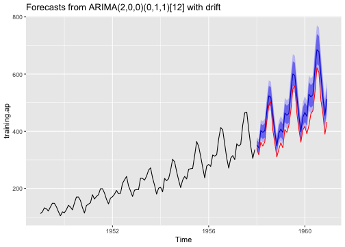<!-- -->

---


```r
ggplot() +
  geom_line(
    aes(
      x = as.numeric(time(forecast.auto.arima$mean)),
      y = as.numeric(forecast.auto.arima$mean)
    ), col = "blue") +
  geom_line(
    aes(
      x = as.numeric(time(test.ap)),
      y = as.numeric(test.ap)
    ), col = "red")
```

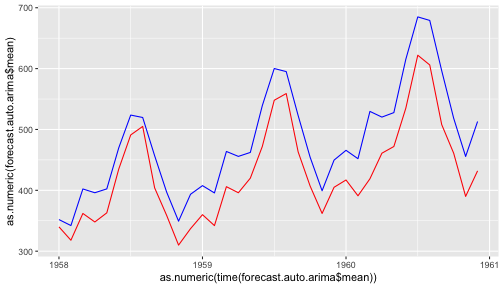<!-- -->

---

## Forecast accuracy


```r
accuracy(forecast.auto.arima, test.ap)
```

```
                      ME      RMSE       MAE          MPE      MAPE      MASE
Training set   0.2519501  7.374714  5.349687   0.04655079  2.410305 0.1749812
Test set     -52.2999480 55.777025 52.299948 -12.30660303 12.306603 1.7106627
                    ACF1 Theil's U
Training set 0.008773659        NA
Test set     0.426944178  1.174056
```
---

## Multi-step ahead forecast

```r
fit.auto.arima %>% forecast(h=36)
```

This repeatedly feeds the **predicted data point** back into the prediction equation to get the next prediction.

<!--Predict the next value. Fit that back to data and refit the original model(same parameter estimates) and then forecast the next. Next forecast is again feed back and refit the original model and predict the next.-->

<!--Resources: https://stats.stackexchange.com/questions/217955/difference-between-first-one-step-ahead-forecast-and-first-forecast-from-fitted-->

---
background-image: url('multi.PNG')
background-position: center
background-size: contain

---
background-image: url('one.PNG')
background-position: center
background-size: contain
---
## One-step ahead forecast.

Continually updating the prediction equation with **new data**.


```r
air_model_test <- Arima(test.ap, model = fit.auto.arima)
# Uses the same coef as the air_model. Nothing is actually "refit"
coef(fit.auto.arima) # Model from auto.arima
```

```
       ar1        ar2       sma1      drift 
 0.5514344  0.2033163 -0.6176601  0.0109900 
```

```r
coef(air_model_test) # Refit the same model to test
```

```
       ar1        ar2       sma1      drift 
 0.5514344  0.2033163 -0.6176601  0.0109900 
```

---

# Obtain one-step ahead forecast


```r
one_step_forecasts <- fitted(air_model_test)
one_step_forecasts
```

```
          Jan      Feb      Mar      Apr      May      Jun      Jul      Aug
1958 338.4291 316.5554 360.3128 346.3955 361.3151 432.9073 488.5841 502.5066
1959 377.0639 344.5653 396.0804 390.3409 414.1117 496.8855 548.4709 565.0832
1960 429.7333 398.1336 457.1674 426.2266 471.3678 550.2350 621.5040 637.2847
          Sep      Oct      Nov      Dec
1958 402.0994 357.3572 308.6301 335.4865
1959 455.3152 410.4582 356.9188 394.4582
1960 508.7447 452.4559 404.6760 441.1924
```

---

# Comparison between one-step ahead forecasts and true values


```r
ggplot() +
  geom_line(
    aes(
      x = as.numeric(time(one_step_forecasts)),
      y = as.numeric(one_step_forecasts)
    ), col = "black") +
  geom_line(
    aes(
      x = as.numeric(time(test.ap)),
      y = as.numeric(test.ap)
    ), col = "red")
```

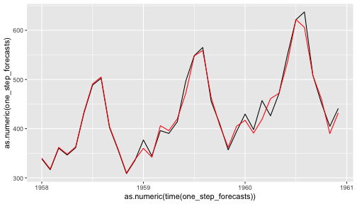<!-- -->

---

## Comparison of accuracy: Multi-step ahead vs one-step ahead


```r
accuracy(one_step_forecasts, test.ap) # One-step ahead
```

```
                ME     RMSE      MAE        MPE    MAPE       ACF1 Theil's U
Test set -2.029239 12.72677 8.175988 -0.4076894 1.86015 -0.2234696 0.2654171
```

```r
accuracy(forecast.auto.arima, test.ap) # Multi-step ahead
```

```
                      ME      RMSE       MAE          MPE      MAPE      MASE
Training set   0.2519501  7.374714  5.349687   0.04655079  2.410305 0.1749812
Test set     -52.2999480 55.777025 52.299948 -12.30660303 12.306603 1.7106627
                    ACF1 Theil's U
Training set 0.008773659        NA
Test set     0.426944178  1.174056
```


---

## Multi-step ahead vs One-step ahead

.pull-left[

# Multi-step


<!-- -->


]

.pull-right[

# One-step ahead

<!-- -->


]

blue - Multi-step ahead; black - One-step ahead; red - True values

---
background-image: url('arimaflowchart.png')
background-position: right
background-size: contain

.footnote[.scriptsize[
source: Forecasting: Principles and Practice, Rob Hyndman and George Athanasopoulos.
]]

---

# Comparison of accuracy measures of different approaches

## ARIMA - manual selection


```r
accuracy(fit1.forecast$mean, test.ap) # Multiple-step ahead
```

```
                ME   RMSE      MAE       MPE     MAPE       ACF1 Theil's U
Test set -33.71566 36.559 33.71566 -8.112567 8.112567 0.08524612 0.7974916
```

You can try one-step ahead forecast for this one too.

## `auto.arima`


```r
accuracy(one_step_forecasts, test.ap) # One-step ahead
```

```
                ME     RMSE      MAE        MPE    MAPE       ACF1 Theil's U
Test set -2.029239 12.72677 8.175988 -0.4076894 1.86015 -0.2234696 0.2654171
```

```r
accuracy(forecast.auto.arima, test.ap) # Multi-step ahead
```

```
                      ME      RMSE       MAE          MPE      MAPE      MASE
Training set   0.2519501  7.374714  5.349687   0.04655079  2.410305 0.1749812
Test set     -52.2999480 55.777025 52.299948 -12.30660303 12.306603 1.7106627
                    ACF1 Theil's U
Training set 0.008773659        NA
Test set     0.426944178  1.174056
```


---
class: center, middle


All rights reserved by [Thiyanga S. Talagala](https://thiyanga.netlify.app/)
